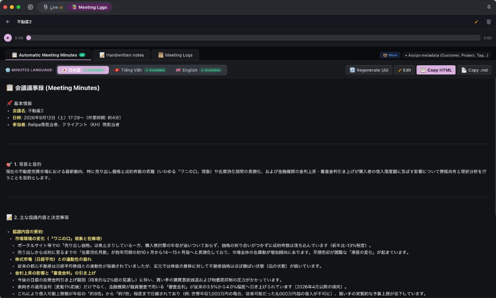

# Meet Minder

  

  <strong>プライバシー重視の多言語会議アシスタント ＆ AI自動議事録作成</strong> 
  <em>リアルタイム音声翻訳・Obsidian風Markdownメモ・AI自動議事録生成</em>

  <strong><a href="README.md">English</a></strong> |
  <strong><a href="README.ja.md">日本語 (Japanese)</a></strong> |
  <strong><a href="README.vi.md">Tiếng Việt (Vietnamese)</a></strong>

  

  
  
  
  
  
  
  

---

## 📌 概要 (Overview)

**Meet Minder** は、グローバルビジネス会議、技術ディスカッション、クライアント商談、多言語ウェビナー向けに開発された、**プライバシー最優先（Privacy-First）**のスタンドアロン・デスクトップアプリケーションです。

**システム音声とマイクのデュアル録音**、超低遅延の**リアルタイム音声翻訳**、Obsidian風の**スマートMarkdownメモ機能（Take Notes）**、そして**AIによる自動議事録生成（AI Meeting Minutes）**を高度に統合しています。

### 🛡️ セキュリティとプライバシーの原則
- **プロキシサーバー非介在（Zero Middleware Proxy）**: WebSocketおよびHTTPSによるAIプロバイダー（Google Gemini、OpenAI、Soniox、Alibaba Qwen）への直接接続。中間サーバーは一切介在しません。
- **完全ローカル保存（100% Local-First）**: 音声録音ファイル（`.wav`）、会話履歴、手書きメモ、議事録のすべてがユーザーの端末内に安全に保存されます。
- **トラッキング一切なし（Zero Telemetry）**: 行動分析や利用ログの第三者送信はありません。
- **安全な暗号化保存**: APIキーはユーザー端末の安全なストレージ領域に暗号化されて保持されます。

---

## ⬇️ ダウンロード (v1.0.0)

最新のインストーラーは [**GitHub Releases**](https://github.com/tuyennq1001/meetminder/releases/latest) からダウンロードできます。

| OS | アーキテクチャ / 対象端末 | インストーラー | ガイド |
| :--- | :--- | :--- | :--- |
| **macOS** | **Apple Silicon** (M1 / M2 / M3 / M4) | `MeetMinder_1.0.0_aarch64.dmg` | [macOS インストール手順](docs/installation_guide_ja.md) |
| **macOS** | **Intel Mac** (i5 / i7 / i9) | `MeetMinder_1.0.0_x64.dmg` | [macOS インストール手順](docs/installation_guide_ja.md) |
| **Windows** | **Windows 10 / 11** (64-bit) | `MeetMinder_1.0.0_x64-setup.exe` | [Windows インストール手順](docs/installation_guide_win.md) |

---

## 🚀 主要機能 (Features)

### 1. リアルタイム音声翻訳エンジン

#### 🥇 1. Google Gemini Multimodal Live API（推奨・最優先）
- **Google AI Studioで完全無料**: クレジットカード不要の充実したFree Tier枠により、日々の通常業務会議を無料でカバー可能。
- **リアルタイム双方向ストリーミング**: WebSocketによるPCMリニア音声の直接ストリーミングで、超低遅延の翻訳を実現。
- **自動モデル探索**: 利用可能な最適モデル（`gemini-2.0-flash`、`gemini-2.5-flash`）を自動検出し接続。
- **高精度な自動議事録生成**: 会議の目的、決定事項、アクションアイテムを的確に抽出。

#### 🥈 2. ローカル MLX パイプライン（Apple Silicon 完全オフライン）
- **完全なオフライン稼働**: Apple SiliconのMetalとNeural Engineを活用し、WhisperとGemmaを端末内のみで実行。
- **データ送信ゼロ**: 外部ネットワークとの通信を一切行わないため、最高レベルの機密会議に最適。
- **永久無料**: API費用やサブスクリプションは不要。

#### 🥉 3. その他のクラウドエンジン
- **Soniox Real-time STT (`stt-rt-v5`)**: 日本語からベトナム語・英語への卓越した翻訳精度、安価な従量課金（約$0.12/時間）、話者分離対応。
- **OpenAI Realtime API**: 音声から音声への高品質な会話翻訳。
- **Alibaba Qwen LiveTranslate Flash**: 高速な多言語テキスト翻訳。

---

### 📊 AIエンジン比較表

| 項目 | 🌟 Google Gemini Live | 🖥️ Local MLX | ☁️ Soniox STT | ⚡ OpenAI Realtime | 🌏 Qwen Live |
| :--- | :--- | :--- | :--- | :--- | :--- |
| **費用** | **無料 (Free Tier)** | **完全無料** | 格安 (~$0.12/h) | 高価格 (~$4.00/h) | 無料プレビュー |
| **遅延速度** | 超低遅延 (~1–2秒) | 低遅延 (~2–3秒) | 最速 (<1秒) | 低遅延 (~1–2秒) | 最速 (~1秒) |
| **オフライン動作** | インターネット必須 | **可能 (100% Offline)**| インターネット必須 | インターネット必須 | インターネット必須 |
| **AI自動議事録** | **極めて優秀** | 基本的 | Gemini経由 | 良好 | 非対応 |
| **用語集登録** | **対応 (組み込み)** | プロンプト形式 | 対応 (API連携) | プロンプト形式 | 非対応 |
| **プライバシー** | 端末 ➔ Google 直接 | **最高 (端末完結)** | 端末 ➔ Soniox 直接 | 端末 ➔ OpenAI 直接 | 端末 ➔ Alibaba |
| **対応環境** | macOS & Windows | Apple Silicon (M1–M4) | macOS & Windows | macOS & Windows | macOS & Windows |

---

### 2. Git自動バックアップ（データ損失防止）

- **自動バージョン管理**: 保存フォルダとGitをシームレスに統合。
- **会議終了時の自動コミット**: 会議終了・保存ボタン（`⌘ T`）を押した瞬間に、議事録・メモ・メタデータを自動コミット。
- **リモートへの定期自動プッシュ**: プライベートなGitHub / GitLab等のリポジトリへ定期的に自動同期（15分・30分・60分間隔）。
- **プッシュ履歴の確認**: 最新5回のプッシュ履歴、コミットハッシュ、同期状態を設定画面で即座に確認可能。

---

### 3. 議事録プロンプト・テンプレート管理

- **プロンプトの完全カスタマイズ**: システムプロンプトおよびユーザープロンプトを会議の種別ごとに自由に設定可能：
  - 朝会・スプリントレビュー
  - システム設計・技術検討会
  - クライアント提案・商談
  - 1-on-1 ミーティング
- **ワンクリック再生成**: 会議メモ追加後もワンクリックで議事録を再生成。

---

### 4. 3タブ・セッション管理（議事録 • メモ • ログ＆プレイヤー）

- **タブ 1: AI議事録 (Meeting Minutes)**: サマリー、決定事項、ToDoリストを自動整理。日本語、英語、ベトナム語に対応。

- **タブ 2: Obsidian風メモ (Take Notes)**: CodeMirror 6搭載のMarkdownエディタ。リアルタイムプレビュー、書式ツールバー、チェックリスト対応。

- **タブ 3: 会議ログ ＆ 音声同期プレイヤー**: 話者ごとの発話タイムライン、二言語対訳表示、クリックした発言箇所へ即座にスキップできる音声再生バー、Re-transcriptおよび `.srt` / `.txt` 出力に対応。

---

### 5. 音声ファイルのインポート（文字起こし＆議事録自動生成）

- **幅広い音声フォーマット対応**: `.mp3`, `.m4a`, `.wav`, `.aac`, `.ogg`, `.flac` などの録音ファイルを簡単に取り込み。
- **ドラッグ＆ドロップ対応**: 音声ファイルをモーダルに直接ドラッグ＆ドロップするか、ローカルフォルダから選択。
- **メタデータ分類**: 取引先（Customer）、プロジェクト（Project）、カテゴリ、タグ、スコープ（Work / Personal）を柔軟に割り当て。
- **AIによる自動文字起こし＆議事録生成**: バックグラウンドで高速に文字起こしを行い、Google Geminiが決定事項やToDoリストを含む議事録を自動生成。
- **完全な会議セッション化**: リアルタイム会議と同様に、音声波形プレイヤー・発話タイムライン・メモ・議事録が揃った完全なセッションとして保存。

---

### 6. 多言語UI対応 (i18n)

全画面・ダイアログ・通知で完全な多言語ローカライズに対応：
- 🇺🇸 **English** (`en`) — 英語
- 🇯🇵 **日本語** (`ja`)
- 🇻🇳 **Tiếng Việt** (`vi`) — ベトナム語

---

## ⌨️ キーボードショートカット一覧

| macOS ショートカット | Windows ショートカット | 操作内容 |
| :--- | :--- | :--- |
| <kbd>⌘</kbd> + <kbd>S</kbd> | <kbd>Ctrl</kbd> + <kbd>S</kbd> | **開始 (Start)** / **一時停止 (Pause)** |
| <kbd>⌘</kbd> + <kbd>C</kbd> | <kbd>Ctrl</kbd> + <kbd>C</kbd> | 一時停止からの**再開 (Continue)** |
| <kbd>⌘</kbd> + <kbd>T</kbd> | <kbd>Ctrl</kbd> + <kbd>T</kbd> | **会議終了 ＆ 保存 (Save & Stop)** |
| <kbd>⌘</kbd> + <kbd>N</kbd> | <kbd>Ctrl</kbd> + <kbd>N</kbd> | **メモ引き出し (Take Note Drawer) の開閉** |
| <kbd>⌘</kbd> + <kbd>L</kbd> | <kbd>Ctrl</kbd> + <kbd>L</kbd> | **リアルタイム画面 (Live Mode)** に切り替え |
| <kbd>⌘</kbd> + <kbd>O</kbd> | <kbd>Ctrl</kbd> + <kbd>O</kbd> | **過去の会議録一覧 (Meeting Logs)** に切り替え |
| <kbd>⌘</kbd> + <kbd>1</kbd> | <kbd>Ctrl</kbd> + <kbd>1</kbd> | 音声ソース: **システム音声（スピーカーのみ）** |
| <kbd>⌘</kbd> + <kbd>2</kbd> | <kbd>Ctrl</kbd> + <kbd>2</kbd> | 音声ソース: **マイク音声のみ** |
| <kbd>⌘</kbd> + <kbd>3</kbd> | <kbd>Ctrl</kbd> + <kbd>3</kbd> | 音声ソース: **システム ＋ マイク（会議推奨）** |
| <kbd>⌘</kbd> + <kbd>,</kbd> | <kbd>Ctrl</kbd> + <kbd>,</kbd> | **設定画面を開く** |
| <kbd>⌘</kbd> + <kbd>P</kbd> | <kbd>Ctrl</kbd> + <kbd>P</kbd> | 最前面固定トグル（実行中は一時停止） |
| <kbd>⌘</kbd> + <kbd>M</kbd> | <kbd>Ctrl</kbd> + <kbd>M</kbd> | ウィンドウの最小化 |
| <kbd>?</kbd> | <kbd>?</kbd> | ショートカット一覧シートを開く |
| <kbd>Esc</kbd> | <kbd>Esc</kbd> | ダイアログを閉じる / 設定を終了して戻る |

---

## 👤 開発者 ＆ サポート

- **開発者**: **Terry**
- **メール**: [tuyennq1001@gmail.com](mailto:tuyennq1001@gmail.com)
- **GitHub**: [https://github.com/tuyennq1001/meetminder](https://github.com/tuyennq1001/meetminder)
- **Issue報告**: [https://github.com/tuyennq1001/meetminder/issues](https://github.com/tuyennq1001/meetminder/issues)

---

## 📄 ライセンス

本プロジェクトは **[MIT License](LICENSE)** のもとで公開されています。個人利用、学術研究、商用利用を含め自由にご活用いただけます。
