# Meet Minder

<p align="center">
  
</p>

<p align="center">
  <strong>Trợ lý Cuộc họp Đa ngôn ngữ Thông minh & Biên bản AI Bảo mật</strong><br>
  <em>Privacy-First Multilingual Meeting Assistant, Real-time Speech Translation & AI Meeting Minutes</em>
</p>

<p align="center">
  
</p>

<p align="center">
  
  
  
  
  
  
</p>

---

## 📌 Giới thiệu tổng quan (Overview)

**Meet Minder** là ứng dụng desktop cao cấp, độc lập và ưu tiên tuyệt đối quyền riêng tư (**Privacy-First**) dành cho các cuộc họp trực tuyến, hội thảo, cuộc gọi song phương và thuyết trình đa ngôn ngữ.

Ứng dụng kết hợp khả năng **thu âm hệ thống & micro kép**, **dịch thuật giọng nói thời gian thực (Real-time Speech Translation)** với độ trễ cực thấp, **ghi chú thông minh chuẩn Markdown phong cách Obsidian (Take Notes)** và **tự động tạo biên bản cuộc họp chuyên nghiệp bằng AI (AI Meeting Minutes)**.

### 🛡️ Cam kết Quyền riêng tư & Bảo mật
- **Không có máy chủ trung gian (Zero Middleware Proxy)**: Mọi kết nối WebSocket / HTTPS đến các nhà cung cấp AI (Google Gemini, OpenAI, Soniox, Alibaba Qwen, ElevenLabs) đều được thực hiện trực tiếp từ máy tính của bạn.
- **Không thu thập dữ liệu người dùng (Zero Telemetry / No Tracking)**: Không có mã theo dõi, không phân tích hành vi người dùng, không gửi dữ liệu về bất kỳ máy chủ bên thứ ba nào.
- **Dữ liệu lưu trữ cục bộ 100% (Local-First Data)**: Toàn bộ lịch sử hội thoại, file ghi âm giọng nói, ghi chú cá nhân và biên bản họp đều được lưu trữ trực tiếp trên ổ cứng người dùng.
- **Khóa API an toàn**: API Keys do người dùng tự cung cấp và được mã hóa lưu trữ an toàn trong vùng nhớ ứng dụng của hệ điều hành.

---

## ⬇️ Tải về bản cài đặt (Downloads)

Tải phiên bản mới nhất từ trang [GitHub Releases](https://github.com/tuyennq1001/meetminder/releases/latest).

| Hệ điều hành | Kiến trúc / Thiết bị | File cài đặt | Hướng dẫn |
| :--- | :--- | :--- | :--- |
| **macOS** | **Apple Silicon** (M1 / M2 / M3 / M4) | `MeetMinder_<version>_aarch64.dmg` | [Hướng dẫn macOS](docs/installation_guide_vi.md) |
| **macOS** | **Intel Core** (i5 / i7 / i9) | `MeetMinder_<version>_x64.dmg` | [Hướng dẫn macOS](docs/installation_guide_vi.md) |
| **Windows** | **Windows 10 / 11** (64-bit) | `MeetMinder_<version>_x64-setup.exe` | [Hướng dẫn Windows](docs/installation_guide_win_vi.md) |

> [!TIP]
> **Cách kiểm tra chip máy Mac**: Nhấp vào menu ** (Apple)** ở góc trên bên trái màn hình ➔ **Giới thiệu về máy Mac này (About This Mac)**:
> - Nếu thấy dòng **Chip: Apple M1/M2/M3/M4** ➔ Chọn bản **`aarch64`**.
> - Nếu thấy dòng **Bộ xử lý: Intel Core...** ➔ Chọn bản **`x64`**.

---

## 🏗️ Kiến trúc hệ thống & Luồng dữ liệu (Architecture & Data Flow)

```mermaid
flowchart TB
    subgraph AudioCapture ["Lớp Bắt âm thanh (Native Audio Capture)"]
        SysAudio["Âm thanh Hệ thống (System Audio)\nmacOS: ScreenCaptureKit | Windows: WASAPI Loopback"]
        MicAudio["Microphone\nRust cpal (Native Audio Stream)"]
    end

    subgraph CorePipeline ["Lớp Xử lý Luồng Âm thanh (Rust Tokio Pipeline)"]
        RingBuf["Audio Ring Buffer & Resampler\n(16kHz / 24kHz / 48kHz Linear PCM)"]
        WavWriter["Dual-Channel / Mixed WAV Recorder\n(Lưu bản ghi âm cục bộ)"]
        VAD["Voice Activity Detection & Chunker"]
    end

    subgraph Engines ["Lớp Engine Dịch thuật & STT Trực tiếp"]
        GeminiLive["Google Gemini Multimodal Live API\n(WebSocket trực tiếp + Auto Model Discovery)"]
        Soniox["Soniox Real-time STT (v5)\n(Diarization + Custom Glossary)"]
        OpenAIRT["OpenAI Realtime Translate\n(Bidirectional Speech + Text)"]
        QwenLive["Alibaba Qwen LiveTranslate Flash\n(Bản dịch nhanh)"]
        LocalMLX["Local MLX Pipeline (Offline)\n(Whisper + Gemma trên Apple Silicon)"]
    end

    subgraph UILayer ["Lớp Giao diện Người dùng (Tauri 2 Frontend)"]
        LiveOverlay["Live Translation Overlay\n• Single / Dual-View Side-by-Side\n• Chế độ 'Không dịch' (Transcription Only)\n• Cỡ chữ linh hoạt tới 140px\n• Luôn trên cùng (Pin Always-on-top)"]
        QuickDrawer["Live Take-Note Drawer\n(Thanh kéo co giãn kích thước trực tiếp)"]
    end

    subgraph SessionHub ["Trung tâm Phiên họp 3 Thẻ (3-Tab Session Viewer)"]
        TabMinutes["Thẻ 1: Biên bản cuộc họp (Meeting Minutes)\n• AI tổng hợp tự động (Gemini / OpenAI)\n• Song ngữ Nhật - Việt (JA/VI) & Đơn ngữ\n• Tùy biến Mẫu Prompt (System & User Templates)"]
        TabNotes["Thẻ 2: Ghi chú thông minh (Take Notes)\n• Trình soạn thảo CodeMirror 6\n• Live Preview chuẩn Markdown Obsidian\n• Toolbar định dạng đầy đủ"]
        TabLogs["Thẻ 3: Nhật ký & Âm thanh (Logs & Audio Player)\n• Dòng transcript kèm nhãn người nói\n• Sửa trực tiếp tiêu đề & nội dung (Inline Edit)\n• Thanh phát âm thanh đồng bộ vị trí thoại"]
    end

    SysAudio --> RingBuf
    MicAudio --> RingBuf
    RingBuf --> WavWriter
    RingBuf --> VAD
    VAD --> GeminiLive
    VAD --> Soniox
    VAD --> OpenAIRT
    VAD --> QwenLive
    VAD --> LocalMLX

    GeminiLive --> LiveOverlay
    Soniox --> LiveOverlay
    OpenAIRT --> LiveOverlay
    QwenLive --> LiveOverlay
    LocalMLX --> LiveOverlay

    LiveOverlay --> QuickDrawer
    LiveOverlay --> SessionHub
```



---

## 🚀 Đặc tả tính năng chi tiết (Feature Specifications)

### 1. Dịch thuật & Ghi lại giọng nói trực tiếp (Live Speech Translation)

- **Hỗ trợ đa dạng Engine tiên tiến**:
  - **Google Gemini Multimodal Live**: Kết nối WebSocket thời gian thực truyền nhận luồng âm thanh PCM 2 chiều, tự động quét và lựa chọn model khả dụng tốt nhất (`gemini-2.0-flash`, `gemini-2.5-flash`, `gemini-3.x-flash`) kèm cơ chế tự động chuyển đổi dự phòng (fallback) sang REST API khi mạng dao động.
  - **Soniox Real-time STT (`stt-rt-v5`)**: Model v5 mang lại chất lượng dịch tiếng Nhật ➔ tiếng Việt vượt trội, nhận diện thuật ngữ chuyên ngành chuẩn xác, độ trễ phản hồi cực nhỏ.
  - **OpenAI Realtime API**: Dịch thuật hội thoại thông minh, hỗ trợ cả phụ đề văn bản và giọng đọc thoại trả lời tức thì.
  - **Alibaba Qwen LiveTranslate Flash**: Giải pháp dịch thuật trực tiếp tốc độ cao trên nền tảng DashScope.
  - **Local MLX (Chạy ngoại tuyến 100%)**: Tận dụng sức mạnh Apple Silicon qua Metal Performance Shaders để chạy Whisper và Gemma hoàn toàn offline, bảo mật tuyệt đối không cần mạng internet.

- **Chế độ hiển thị linh hoạt**:
  - **Chế độ Song ngữ (Dual View)**: Hiển thị song song hai cột hoặc chia lớp (Văn bản gốc bên trái/trên - Bản dịch bên phải/dưới).
  - **Chế độ Đơn ngữ (Single View)**: Chỉ hiển thị nội dung dịch thuật hoặc nội dung gốc theo nhu cầu.
  - **Chế độ "Không dịch" (Source Transcription Only)**: Tắt dịch thuật, chỉ nhận diện chính xác từng câu nói của người tham gia (rất hữu ích cho các cuộc họp nội bộ cùng ngôn ngữ).
  - **Tự động cuộn thông minh (Smart Scroll)**: Tự động cuộn theo câu nói mới nhất nhưng giữ nguyên vị trí khi người dùng chủ động lăn chuột xem lại các câu thoại trước đó.
  - **Kích thước phông chữ phòng họp**: Điều chỉnh kích thước văn bản từ cỡ thông thường (14px) đến cỡ cực lớn (140px) hiển thị rõ ràng trên màn hình máy chiếu hoặc TV phòng họp lớn.
  - **Tùy chỉnh giao diện**: Hỗ trợ đổi họ phông chữ (Font Family), màu chữ theo độ tương phản, chế độ thu nhỏ gọn (Compact mode), và tính năng tự động ẩn thanh công cụ khi rảnh chuột.

- **Từ điển chuyên ngành & Cặp ngữ cảnh (Custom Terms & Context Pairs)**:
  - Cho phép người dùng nhập trước danh sách từ vựng chuyên ngành, tên riêng dự án, từ viết tắt công nghệ hoặc ngữ cảnh riêng của doanh nghiệp.
  - Hệ thống tự động gắn ngữ cảnh vào luồng dịch để đảm bảo tên sản phẩm, công nghệ hay tên nhân sự không bao giờ bị dịch sai nghĩa.

---

### 2. Trình quản lý phiên họp 3 Thẻ (3-Tab Session Viewer)

Sau mỗi cuộc họp, toàn bộ dữ liệu được tổng hợp vào màn hình chi tiết với 3 phân hệ chuyên sâu:

#### 📑 Thẻ 1: Biên bản cuộc họp (Meeting Minutes)
- **Tự động tổng hợp thông minh bằng AI**: Tự động phân tích toàn bộ cuộc hội thoại bằng Google Gemini hoặc OpenAI để trích xuất:
  1. Mục tiêu và bối cảnh cuộc họp.
  2. Các nội dung thảo luận trọng tâm.
  3. Quyết định đã được thống nhất (Key Decisions).
  4. Danh sách nhiệm vụ cần làm (Action Items) gán rõ người phụ trách và thời hạn.
- **Hỗ trợ Song ngữ & Đơn ngữ**:
  - Tự động tạo biên bản song ngữ Nhật - Việt (JA/VI) giúp cả đối tác nước ngoài và đội ngũ nội bộ nắm bắt thông tin đồng thời.
  - Tự động chuyển sang biên bản đơn ngữ khi cuộc họp diễn ra ở chế độ "Không dịch".
- **Quản lý Mẫu biên bản (Prompt Templates Manager)**:
  - Cho phép tùy biến toàn bộ **System Prompt** và **User Prompt Template** trong phần Cài đặt.
  - Sử dụng các biến nội suy mạnh mẽ: `{TRANSCRIPT}`, `{TITLE}`, `{DATE}`, `{CUSTOMER}`, `{PROJECT}`.
  - Khả năng tạo lại biên bản (Re-generate) với 1 cú nhấp chuột hoặc chỉnh sửa nội dung trực tiếp trên giao diện Markdown.

#### 📝 Thẻ 2: Ghi chú thông minh (Take Notes - Phong cách Obsidian)
- **Tích hợp trình soạn thảo CodeMirror 6**: Hỗ trợ viết Markdown mượt mà với tính năng **Live Preview** tức thì.
- **Thanh công cụ định dạng trực quan**:
  - Tiêu đề Heading (H1, H2, H3)
  - Định dạng ký tự: **In đậm**, *In nghiêng*, Gạch chân
  - Danh sách: Gạch đầu dòng (Bullet list), Đánh số thứ tự (Numbered list), Danh sách việc cần làm (Task checklist `[ ]` / `[x]`)
  - Khối trích dẫn (Blockquote), Khối mã nguồn (Code block), Đường kẻ phân cách
- **Ngăn kéo ghi chú nhanh (Take-Note Drawer)**: Có thể mở ngay khi đang trong cuộc họp trực tiếp; hỗ trợ thanh kéo chia đôi màn hình (Splitter) để phóng to/thu nhỏ khung ghi chú mà không làm gián đoạn theo dõi bản dịch.

#### 🎙️ Thẻ 3: Nhật ký hội thoại & Thanh phát lại âm thanh (Logs & Audio Player Bar)
- **Phân tách người nói (Speaker Diarization)**: Đánh dấu rõ ràng ai đang nói kèm mốc thời gian chính xác từng giây.
- **Chỉnh sửa trực tiếp tại chỗ (Inline Edit)**: Người dùng có thể click trực tiếp vào tiêu đề cuộc họp hoặc bất kỳ dòng hội thoại nào để sửa lại các từ nhận diện chưa chuẩn.
- **Thanh phát lại âm thanh tích hợp (Synchronized Audio Player Bar)**:
  - Hiển thị thanh thời lượng và dạng sóng âm thanh trực quan (Scrubber waveform).
  - Điều khiển: Phát/Tạm dừng, tua lại 5 giây, tua tới 5 giây, điều chỉnh tốc độ đọc (0.75x, 1.0x, 1.25x, 1.5x, 2.0x).
  - Nhấp vào bất kỳ dòng transcript nào để tự động tua bản ghi âm tới đúng thời điểm câu thoại đó được phát ra.

---

### 3. Tổ chức không gian làm việc & Chuỗi cuộc họp (Workspace Organization)

- **Cấu trúc phân cấp dữ liệu**:
  - **Khách hàng (Customers)** ➔ **Dự án (Projects)** ➔ **Cuộc họp (Sessions)**.
  - Dễ dàng lọc và tra cứu lại lịch sử họp của từng đối tác và dự án cụ thể.
- **Hệ thống Thẻ gắn (Tags) & Phân loại**:
  - Gắn thẻ linh hoạt (`#kickoff`, `#sprint-review`, `#architecture`, `#daily`, v.v.).
  - Tìm kiếm toàn văn nhanh chóng theo tiêu đề, nội dung hội thoại và thẻ tag.
- **Chuỗi liên kết cuộc họp (Meeting Chain Linking)**:
  - Khả năng liên kết nhiều phiên họp liên quan hoặc họp định kỳ thành một chuỗi (Chain).
  - Giúp theo dõi mạch thảo luận xuyên suốt các tuần và cho phép AI tổng hợp tiến độ từ cuộc họp trước sang cuộc họp tiếp theo.
- **Công thức đặt tên tự động (Custom Title Formats)**:
  - Thiết lập cú pháp tự động đặt tên file và tiêu đề cuộc họp, ví dụ: `[{customer}] {project} - {date} {time}`.

---

### 4. Chế độ Đọc (Read Mode / TTS Reader)

- Phân hệ chuyển đổi văn bản thành giọng nói (Text-to-Speech) chất lượng cao dành cho tiếng Việt.
- Dán hoặc gõ văn bản bất kỳ để máy đọc to thành tiếng mà không giới hạn độ dài ký tự (hệ thống tự động phân tách câu thông minh).
- **Các nhà cung cấp giọng đọc phong phú**:
  - **Local Piper Neural TTS (100% Offline)**: Giọng đọc nơ-ron tổng hợp trên máy thông qua `sherpa-onnx`, không cần mạng, không tốn chi phí API, tải trực tiếp các giọng đọc Việt/Anh về máy.
  - **Microsoft Edge TTS**: Miễn phí, chất lượng tự nhiên cao, phản hồi nhanh.
  - **Google Cloud TTS**: Hỗ trợ khóa API cá nhân của người dùng.
  - **ElevenLabs**: Đỉnh cao giọng đọc AI cảm xúc chân thực.

---

## ⚙️ Đặc tả kỹ thuật (Technical Specifications)

| Thành phần | Chi tiết công nghệ |
| :--- | :--- |
| **Framework nền tảng** | [Tauri v2](https://v2.tauri.app/) (Desktop runtime bảo mật & tối ưu tài nguyên) |
| **Ngôn ngữ Backend** | [Rust 2021 Edition](https://www.rust-lang.org/), Async Runtime [Tokio](https://tokio.rs/) |
| **Giao diện Frontend** | Vanilla JavaScript (ES Modules hiện đại), Modern CSS3 với CSS Custom Variables |
| **Trình soạn thảo Markdown** | [CodeMirror 6](https://codemirror.net/) & Lezer Markdown Parser |
| **Thu âm hệ thống macOS** | macOS ScreenCaptureKit Native API (Yêu cầu macOS 13.0+) |
| **Thu âm hệ thống Windows** | Windows WASAPI Audio Loopback Capture |
| **Thu âm Micro** | Thư viện đa nền tảng `cpal` (CoreAudio trên macOS, WASAPI/MME trên Windows) |
| **Tổng hợp giọng nói nội bộ** | [sherpa-onnx](https://github.com/k2-fsa/sherpa-onnx) + Piper VITS Models |
| **Định dạng âm thanh luân chuyển** | Linear PCM 16-bit, Little Endian, 16kHz / 24kHz Mono & Stereo |
| **Định dạng file ghi âm** | WAV (PCM 16-bit), lưu tự động tại thư mục dữ liệu ứng dụng |
| **Định dạng file phiên họp** | JSON (Metadata, Transcript Segments, Speaker IDs, Timestamps, Minutes, Notes) |
| **Hệ thống phím tắt toàn cục** | Hỗ trợ Global Shortcuts thông qua Tauri plugin |

---

## ⌨️ Bảng phím tắt tiện ích (Keyboard Shortcuts)

| Phím tắt (macOS) | Phím tắt (Windows) | Chức năng |
| :--- | :--- | :--- |
| `Space` / `⌘ ↵` | `Space` / `Ctrl ↵` | Bắt đầu hoặc Dừng phiên họp trực tiếp |
| `⌘ P` | `Ctrl P` | Bật / Tắt chế độ Ghim cửa sổ trên cùng (Always on Top) |
| `⌘ ,` | `Ctrl ,` | Mở nhanh cửa sổ Cài đặt hệ thống |
| `⌘ 1` | `Ctrl 1` | Chuyển nguồn âm thanh sang: **Chỉ âm thanh hệ thống** |
| `⌘ 2` | `Ctrl 2` | Chuyển nguồn âm thanh sang: **Chỉ Micro** |
| `⌘ 3` | `Ctrl 3` | Chuyển nguồn âm thanh sang: **Hệ thống + Micro kết hợp** |
| `⌘ M` | `Ctrl M` | Thu nhỏ cửa sổ ứng dụng |
| `?` | `?` | Mở bảng tra cứu phím tắt nhanh |

---

## 🛠️ Hướng dẫn phát triển & Đóng gói (Development & Build)

### Yêu cầu hệ điều hành & Công cụ
- **Node.js**: Phiên bản 18.0 trở lên (khuyến nghị Node 20 LTS).
- **Rust & Cargo**: Bản stable mới nhất (`rustup update`).
- **macOS**: macOS 13.0 (Ventura) trở lên kèm Xcode Command Line Tools (`xcode-select --install`).
- **Windows**: Windows 10/11 64-bit kèm Visual Studio C++ Build Tools.

### Các bước cài đặt và chạy thử nghiệm

1. **Clone mã nguồn dự án**:
   ```bash
   git clone https://github.com/tuyennq1001/meetminder.git
   cd meetminder
   ```

2. **Cài đặt các gói phụ thuộc (Dependencies)**:
   ```bash
   npm install
   ```

3. **Biên dịch gói CodeMirror 6 Editor**:
   ```bash
   npm run build:editor
   ```

4. **Khởi chạy ứng dụng trong môi trường phát triển (Development Mode)**:
   ```bash
   npm run dev
   ```

5. **Kiểm tra mã nguồn (Linting & Formatting)**:
   ```bash
   npm run lint     # Chạy Cargo clippy kiểm tra chất lượng code Rust
   npm run format   # Định dạng lại code Rust bằng Cargo fmt
   ```

6. **Đóng gói ứng dụng phát hành (Production Build)**:
   ```bash
   npm run build    # Đóng gói ứng dụng thành file .app trên macOS hoặc .exe trên Windows
   ```

---

## 📄 Giấy phép (License)

Dự án được phát hành theo giấy phép mã nguồn mở **[MIT License](LICENSE)**. Toàn bộ mã nguồn hoàn toàn tự do cho mục đích nghiên cứu, phát triển và sử dụng cá nhân hoặc doanh nghiệp.

