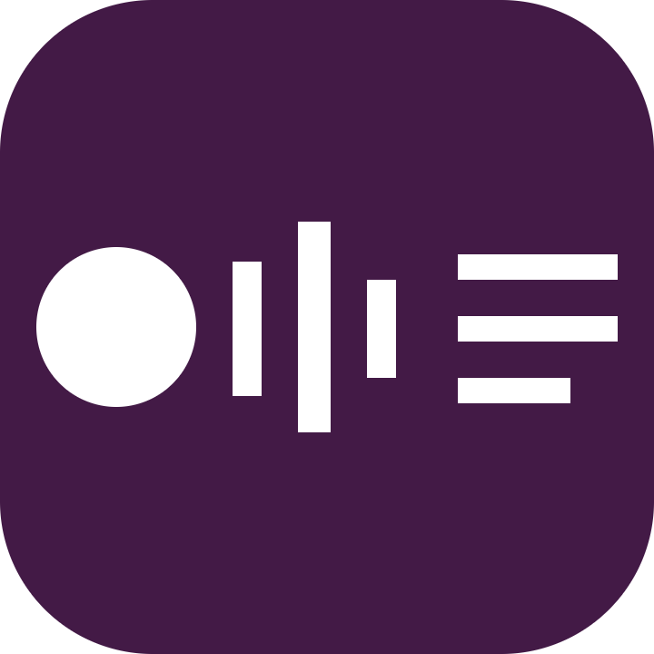
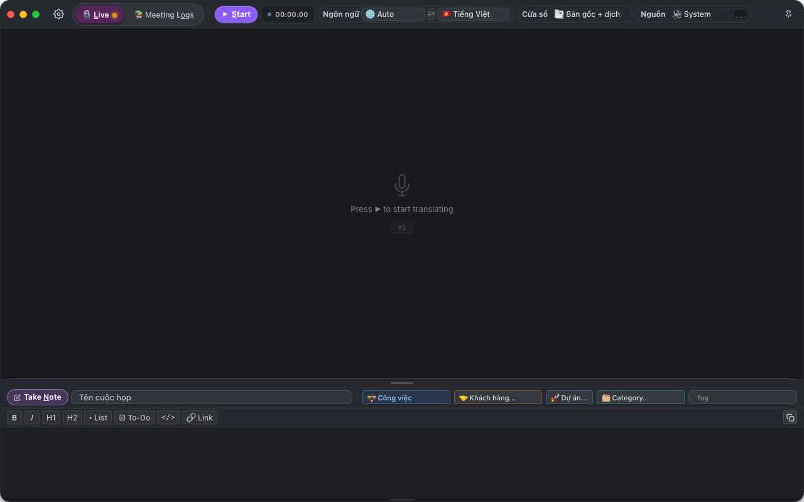
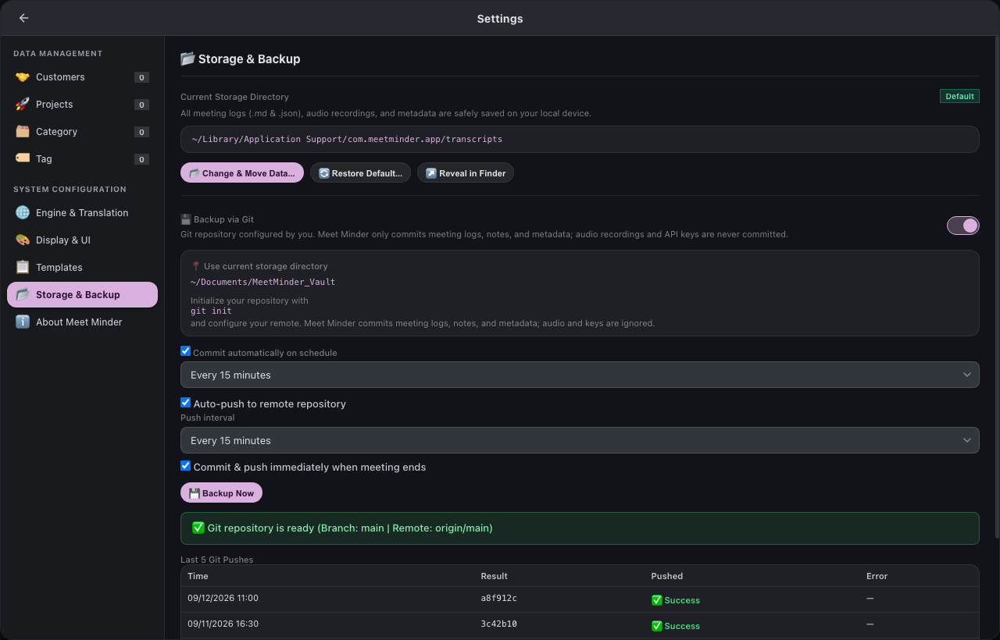
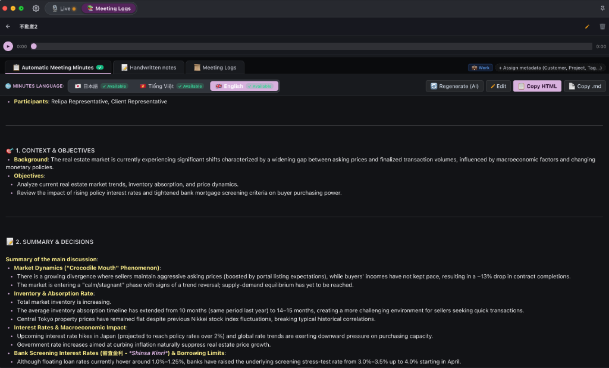
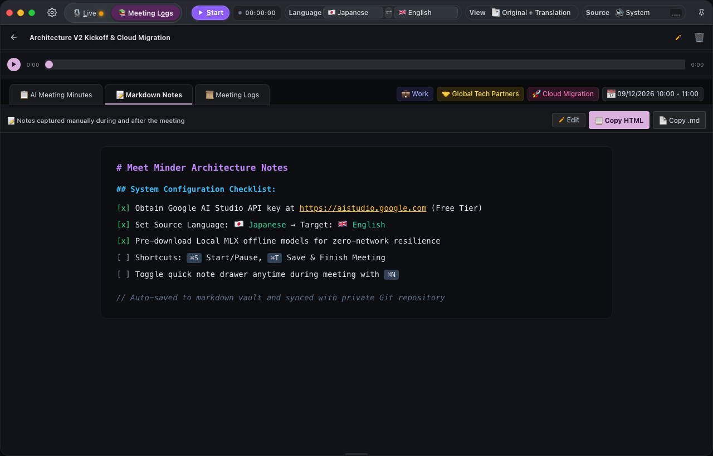
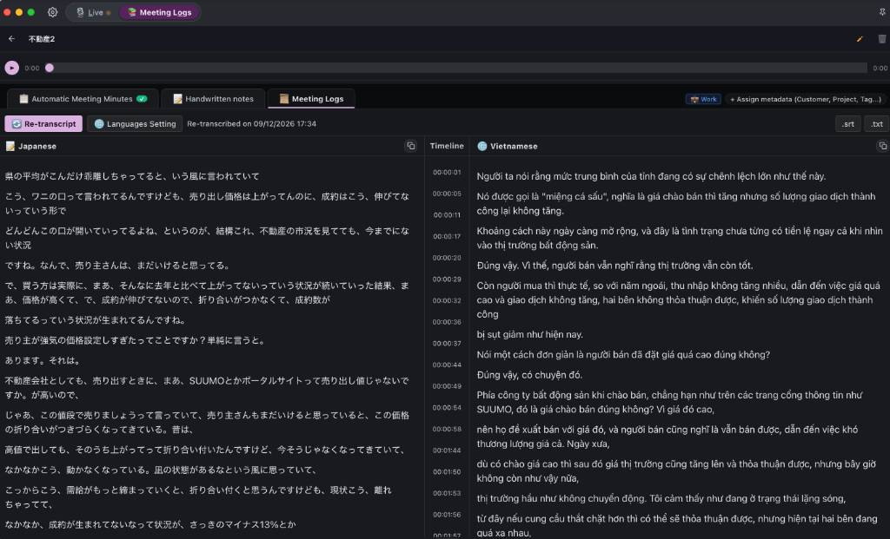

# Meet Minder

<p align="center">
  
</p>

<p align="center">
  <strong>Trợ lý Cuộc họp Đa ngôn ngữ Thông minh & Biên bản AI Bảo mật</strong><br>
  <em>Phiên dịch giọng nói thời gian thực, ghi chú Markdown Obsidian & tự động tạo biên bản cuộc họp</em>
</p>

<p align="center">
  <strong><a href="README.md">English</a></strong> |
  <strong><a href="README.ja.md">日本語 (Japanese)</a></strong> |
  <strong><a href="README.vi.md">Tiếng Việt (Vietnamese)</a></strong>
</p>

<p align="center">
  
</p>

<p align="center">
  
  
  
  
  
  
  
</p>

---

## 📌 Giới thiệu tổng quan (Overview)

**Meet Minder** là ứng dụng desktop độc lập, ưu tiên tuyệt đối quyền riêng tư (**Privacy-First**) dành cho các cuộc họp trực tuyến, hội thảo kỹ thuật, cuộc gọi thương lượng và thuyết trình đa ngôn ngữ.

Ứng dụng tích hợp hoàn hảo khả năng **thu âm hệ thống & micro kép**, **dịch thuật giọng nói thời gian thực (Real-time Speech Translation)** với độ trễ siêu thấp, **ghi chú thông minh chuẩn Markdown phong cách Obsidian (Take Notes)** và **tự động tạo biên bản cuộc họp chuyên nghiệp bằng AI (AI Meeting Minutes)**.

### 🛡️ Cam kết Quyền riêng tư & Bảo mật
- **Không máy chủ trung gian (Zero Middleware Proxy)**: Kết nối WebSocket / HTTPS trực tiếp từ máy tính của bạn đến nhà cung cấp AI. Không có server trung gian lưu trữ hay chuyển tiếp.
- **Lưu trữ cục bộ 100% (Local-First Data)**: Toàn bộ file ghi âm (`.wav`), phụ đề transcript, ghi chú cá nhân và biên bản họp đều nằm trọn vẹn trên máy của bạn.
- **Không thu thập dữ liệu (Zero Telemetry)**: Không gắn mã theo dõi, không phân tích hành vi, không gửi log ra ngoài.
- **Mã hóa khoá API an toàn**: API Key do bạn tự cấu hình và được mã hoá an toàn trong vùng nhớ ứng dụng của hệ điều hành.

---

## ⬇️ Tải về bản cài đặt (v1.0.0)

Tải phiên bản mới nhất từ trang [**GitHub Releases**](https://github.com/tuyennq1001/meetminder/releases/latest).

| Hệ điều hành | Kiến trúc / Thiết bị | File cài đặt | Hướng dẫn |
| :--- | :--- | :--- | :--- |
| **macOS** | **Apple Silicon** (M1 / M2 / M3 / M4) | `MeetMinder_1.0.0_aarch64.dmg` | [Hướng dẫn macOS](docs/installation_guide_vi.md) |
| **macOS** | **Intel Mac** (i5 / i7 / i9) | `MeetMinder_1.0.0_x64.dmg` | [Hướng dẫn macOS](docs/installation_guide_vi.md) |
| **Windows** | **Windows 10 / 11** (64-bit) | `MeetMinder_1.0.0_x64-setup.exe` | [Hướng dẫn Windows](docs/installation_guide_win_vi.md) |

---

## 🚀 Tính năng nổi bật

### 1. Dịch thuật & Nhận diện giọng nói thời gian thực



#### 🥇 1. Google Gemini Multimodal Live API (Khuyên dùng hàng đầu)
- **Hoàn toàn miễn phí qua Google AI Studio**: Hạn ngạch gói Free Tier rất lớn, đáp ứng thoải mái nhu cầu họp hàng ngày mà không cần thẻ tín dụng.
- **Truyền nhận âm thanh 2 chiều thời gian thực**: Kết nối WebSocket trực tiếp stream luồng PCM audio, dịch câu thoại với độ trễ cực thấp.
- **Tự động quét & chọn model tối ưu**: Tự động phát hiện và kết nối với model tốt nhất (`gemini-2.0-flash`, `gemini-2.5-flash`).
- **Tạo biên bản họp cực đỉnh**: Khả năng phân tích ngữ cảnh xuất sắc, trích xuất mục tiêu, quyết định trọng tâm (Key Decisions) và việc cần làm (Action Items).

#### 🥈 2. Local MLX Pipeline (Ngoại tuyến 100% trên Apple Silicon)
- **Bảo mật tuyệt đối, không cần Internet**: Chạy trực tiếp trên Neural Engine và GPU của chip Apple Silicon (Whisper + Gemma).
- **Không truyền dữ liệu ra ngoài**: Hoàn toàn an tâm cho các cuộc họp cơ mật, họp nội bộ, nơi không có Wi-Fi.
- **Miễn phí trọn đời**: Không mất phí API, không lệ thuộc máy chủ.

#### 🥉 3. Các Engine Cloud chuyên biệt khác
- **Soniox Real-time STT (`stt-rt-v5`)**: Độ chuẩn xác dịch tiếng Nhật ➔ tiếng Việt/tiếng Anh hàng đầu, chi phí cực hạt dẻ (~$0.12/giờ âm thanh), phân tách người nói (Diarization).
- **OpenAI Realtime API**: Dịch thuật hội thoại đàm thoại cao cấp kèm giọng đọc tự nhiên.
- **Alibaba Qwen LiveTranslate Flash**: Dịch phụ đề nhanh 60+ ngôn ngữ qua DashScope.

---

### 📊 Bảng so sánh các Engine AI

| Tiêu chí | 🌟 Google Gemini Live | 🖥️ Local MLX | ☁️ Soniox STT | ⚡ OpenAI Realtime | 🌏 Qwen Live |
| :--- | :--- | :--- | :--- | :--- | :--- |
| **Chi phí** | **Miễn phí (Free Tier)** | **Miễn phí 100%** | Siêu rẻ (~$0.12/h) | Cao (~$4.00/h) | Miễn phí preview |
| **Độ trễ** | Cực thấp (~1–2s) | Thấp (~2–3s) | Siêu thấp (<1s) | Thấp (~1–2s) | Siêu thấp (~1s) |
| **Chạy Ngoại tuyến (Offline)** | Cần Internet | **Có (100% Offline)**| Cần Internet | Cần Internet | Cần Internet |
| **Tạo Biên bản họp (Minutes)** | **Xuất sắc (AI Agent)**| Cơ bản | Hỗ trợ qua Gemini | Tốt | Không hỗ trợ |
| **Mức độ Riêng tư** | Trực tiếp ➔ Google | **Cực đại (Nội bộ)** | Trực tiếp ➔ Soniox | Trực tiếp ➔ OpenAI | Trực tiếp ➔ Alibaba |
| **Hỗ trợ thiết bị** | macOS & Windows | Apple Silicon (M1–M4) | macOS & Windows | macOS & Windows | macOS & Windows |

---

### 2. Tự động Sao lưu qua Git (Auto Git Backup)



- **Quản lý phiên bản tự động**: Tích hợp trực tiếp với thư mục lưu trữ dữ liệu cuộc họp.
- **Tự động commit khi kết thúc cuộc họp**: Lưu toàn bộ biên bản, ghi chú và metadata ngay khi bấm Lưu cuộc họp (`⌘ T`).
- **Tự động push định kỳ lên remote**: Đẩy dữ liệu lên kho Git riêng tư (GitHub, GitLab, Bitbucket) theo chu kỳ (15, 30, 60 phút).
- **Lịch sử push minh bạch**: Kiểm tra 5 lần push gần nhất, mã hash commit và trạng thái đồng bộ ngay trong Cài đặt.

---

### 3. Quản lý Mẫu Biên bản Cuộc họp (Prompt Templates Manager)

- **Tùy biến Prompt toàn diện**: Thiết lập System Prompt và User Prompt riêng cho từng thể loại cuộc họp:
  - Họp Daily Standup & Sprint Review
  - Thảo luận Kiến trúc kỹ thuật & Giải pháp
  - Đề xuất giải pháp & Thương thảo hợp đồng với Khách hàng
  - Họp 1-on-1 định kỳ
- **Tạo lại biên bản với 1 cú click**: Dễ dàng tổng hợp lại biên bản khi có bổ sung ghi chú mới.

---

### 4. Trình quản lý phiên họp 3 Thẻ (3-Tab Session Viewer)

- **Thẻ 1: Biên bản cuộc họp (Meeting Minutes)**: AI tự động phân tích mục tiêu, quyết định đã chốt và danh sách việc cần làm (hỗ trợ tiếng Anh, Nhật, Việt).



- **Thẻ 2: Ghi chú thông minh (Take Notes - Phong cách Obsidian)**: Soạn thảo Markdown mượt mà với CodeMirror 6, Live Preview tức thì, toolbar định dạng đầy đủ, checklist việc cần làm (`[ ]` / `[x]`).



- **Thẻ 3: Nhật ký hội thoại & Thanh phát lại âm thanh**: Hiển thị song ngữ thời gian thực, đồng bộ vị trí nghe âm thanh theo từng câu thoại, hỗ trợ gõ lại (Re-transcript) và xuất định dạng phụ đề `.srt` / `.txt`.



---

### 5. Import File Ghi Âm Cuộc Họp (Transcribe & Tự Động Tạo Biên Bản)

- **Hỗ trợ đa dạng định dạng âm thanh**: Nhập file ghi âm từ điện thoại, máy ghi âm hoặc phần mềm họp online: `.mp3`, `.m4a`, `.wav`, `.aac`, `.ogg`, `.flac`.
- **Kéo thả tiện lợi**: Kéo thả trực tiếp file âm thanh vào hộp thoại Import hoặc duyệt chọn từ ổ đĩa.
- **Gán Metadata quản lý chuyên nghiệp**: Phân loại theo Khách hàng, Dự án, Category cuộc họp, Thẻ (Tags) và Phân vùng (Công việc / Cá nhân).
- **Tự động nhận diện & Tạo Meeting Minutes**: Hệ thống tự động chuyển đổi âm thanh thành văn bản chạy ngầm và gọi Google Gemini tổng hợp biên bản với danh sách việc cần làm.
- **Lưu trữ phiên họp đầy đủ**: Phiên họp import sở hữu đầy đủ thanh phát âm thanh đồng bộ, timeline phát biểu từng câu, ghi chú và biên bản tương tự như cuộc họp trực tiếp.

---

### 6. Giao diện Đa ngôn ngữ (Multi-Language UI)

Meet Minder hỗ trợ bản địa hóa giao diện 3 ngôn ngữ:
- 🇺🇸 **English** (`en`) — Tiếng Anh
- 🇯🇵 **日本語** (`ja`) — Tiếng Nhật
- 🇻🇳 **Tiếng Việt** (`vi`) — Tiếng Việt

---

## ⌨️ Bảng phím tắt tiện ích (Keyboard Shortcuts)

| Phím tắt (macOS) | Phím tắt (Windows) | Chức năng thao tác |
| :--- | :--- | :--- |
| <kbd>⌘</kbd> + <kbd>S</kbd> | <kbd>Ctrl</kbd> + <kbd>S</kbd> | **Bắt đầu (Start)** / **Tạm dừng (Pause)** phiên dịch |
| <kbd>⌘</kbd> + <kbd>C</kbd> | <kbd>Ctrl</kbd> + <kbd>C</kbd> | **Tiếp tục (Continue)** sau khi tạm dừng |
| <kbd>⌘</kbd> + <kbd>T</kbd> | <kbd>Ctrl</kbd> + <kbd>T</kbd> | **Kết thúc cuộc họp & Lưu dữ liệu (Save & Stop)** |
| <kbd>⌘</kbd> + <kbd>N</kbd> | <kbd>Ctrl</kbd> + <kbd>N</kbd> | **Mở / Đóng ngăn kéo Ghi chú (Take Note Drawer)** |
| <kbd>⌘</kbd> + <kbd>L</kbd> | <kbd>Ctrl</kbd> + <kbd>L</kbd> | Chuyển sang màn hình **Trực tiếp (Live mode)** |
| <kbd>⌘</kbd> + <kbd>O</kbd> | <kbd>Ctrl</kbd> + <kbd>O</kbd> | Chuyển sang màn hình **Kho lưu trữ cuộc họp (Meeting Logs)** |
| <kbd>⌘</kbd> + <kbd>1</kbd> | <kbd>Ctrl</kbd> + <kbd>1</kbd> | Nguồn thu: **Chỉ âm thanh hệ thống (Loa)** |
| <kbd>⌘</kbd> + <kbd>2</kbd> | <kbd>Ctrl</kbd> + <kbd>2</kbd> | Nguồn thu: **Chỉ Micro** |
| <kbd>⌘</kbd> + <kbd>3</kbd> | <kbd>Ctrl</kbd> + <kbd>3</kbd> | Nguồn thu: **Hệ thống + Micro kết hợp (Mặc định khi họp)** |
| <kbd>⌘</kbd> + <kbd>,</kbd> | <kbd>Ctrl</kbd> + <kbd>,</kbd> | **Mở Cửa sổ Cài đặt (Settings)** |
| <kbd>⌘</kbd> + <kbd>P</kbd> | <kbd>Ctrl</kbd> + <kbd>P</kbd> | Ghim cửa sổ nổi trên cùng (Tạm dừng khi đang chạy) |
| <kbd>⌘</kbd> + <kbd>M</kbd> | <kbd>Ctrl</kbd> + <kbd>M</kbd> | Thu nhỏ cửa sổ |
| <kbd>?</kbd> | <kbd>?</kbd> | Mở bảng tra cứu phím tắt nhanh |
| <kbd>Esc</kbd> | <kbd>Esc</kbd> | Đóng modal / Thoát cài đặt / Về màn hình Live |

---

## 🛠️ Hướng dẫn phát triển & Đóng gói (Development)

```bash
# 1. Clone mã nguồn
git clone https://github.com/tuyennq1001/meetminder.git
cd meetminder

# 2. Cài đặt dependencies
npm install

# 3. Build CodeMirror 6 bundle
npm run build:editor

# 4. Chạy môi trường phát triển
npm run dev

# 5. Kiểm tra mã nguồn (lint & format)
npm run lint
npm run format

# 6. Đóng gói bản phát hành chính thức
npm run build
```

---

## 👤 Tác giả & Kênh hỗ trợ

- **Tác giả & Phát triển**: **Terry**
- **Email hỗ trợ**: [tuyennq1001@gmail.com](mailto:tuyennq1001@gmail.com)
- **GitHub Repository**: [https://github.com/tuyennq1001/meetminder](https://github.com/tuyennq1001/meetminder)
- **Báo lỗi & Đóng góp ý kiến**: [https://github.com/tuyennq1001/meetminder/issues](https://github.com/tuyennq1001/meetminder/issues)

---

## 📄 Giấy phép (License)

Dự án được phát hành theo giấy phép **[MIT License](LICENSE)**. Hoàn toàn tự do cho mục đích nghiên cứu, học tập, sử dụng cá nhân và thương mại.
