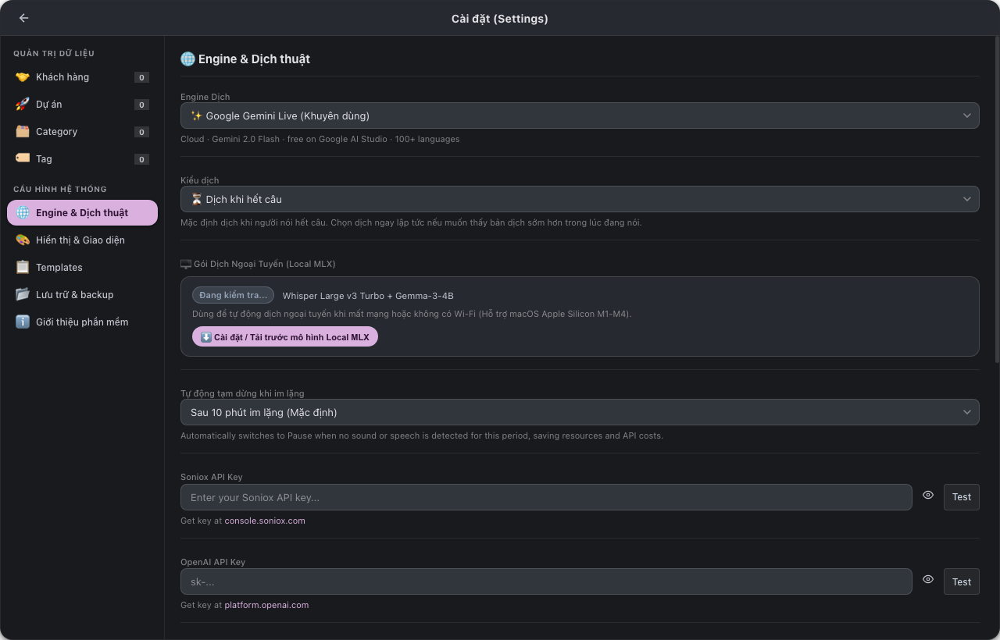

# Meet Minder Installation & Configuration Guide (macOS)

Comprehensive step-by-step guide to installing, configuring, and using **Meet Minder v1.0** on macOS.

---

## 📌 System Requirements

- **Operating System**: macOS 13.0 (Ventura) or later.
- **Supported Hardware**:
  - **Apple Silicon** (M1 / M2 / M3 / M4) — Recommended for peak performance and 100% offline Local MLX transcription.
  - **Intel Mac** (i5 / i7 / i9) — Fully supported with all cloud engines (Gemini, Soniox, OpenAI, Qwen).
- **Permissions**: **Screen & System Audio Recording** and **Microphone** permissions required to capture meeting audio.

---

## Step 1 — Download v1.0.0 Release

Visit [**GitHub Releases — Meet Minder**](https://github.com/tuyennq1001/meetminder/releases/latest) and download the file for your Mac architecture:

| Architecture | Installer File | Supported Devices |
| :--- | :--- | :--- |
| **Apple Silicon** | `MeetMinder_1.0.0_aarch64.dmg` | Apple M1, M2, M3, M4 (MacBook, Mac mini, iMac, Mac Studio) |
| **Intel Mac** | `MeetMinder_1.0.0_x64.dmg` | All Intel Core-based Mac systems |

> [!TIP]
> **Check your Mac architecture:**
> Click the ** (Apple)** icon at top-left ➔ **About This Mac**:
> - If you see **Chip: Apple M...** ➔ Choose **`aarch64`**.
> - If you see **Processor: Intel Core...** ➔ Choose **`x64`**.

---

## Step 2 — Installation

1. Double-click the downloaded `.dmg` file to mount it.
2. Drag the **Meet Minder** icon into your **Applications** folder.
3. Eject the DMG disk and open **Meet Minder** from Applications or Spotlight (`⌘ Space`).

---

## Step 3 — Grant Audio & Microphone Permissions

On initial launch, macOS requires two permissions to capture meeting audio:

1. **Screen & System Audio Recording**:
   - Click **Open System Settings** when prompted.
   - Locate **Meet Minder** in the list and toggle the switch to **ON**.
   - Click **Quit & Reopen** when prompted for changes to take effect.
   > *Note: Meet Minder strictly uses Apple's native ScreenCaptureKit API to capture output audio from applications (Zoom, Teams, Google Meet, YouTube). It never captures or records your screen video.*

2. **Microphone**:
   - On your first translation session, macOS will request microphone access. Click **OK / Allow** so the app can hear your voice.

---

## Step 4 — Select & Configure AI Engines

Meet Minder supports five cutting-edge speech translation engines:

### 🥇 Choice 1 (Recommended): Google Gemini Multimodal Live API

> 🌟 **Primary Engine**: Ultra-low latency bidirectional WebSocket streaming, automatic model discovery (`gemini-2.0-flash`, `gemini-2.5-flash`), and **completely FREE** via Google AI Studio's generous Free Tier.

- **Cost**: **$0 / Free** (Google AI Studio provides a free quota that easily covers daily meetings without entering a credit card).
- **Key Features**:
  - Direct 2-way PCM audio streaming with near-instant translation.
  - Generates comprehensive **AI Meeting Minutes**: automatically extracts Executive Summary, Key Decisions, and Action Items.
  - Automatically respects your custom **Project Glossary** and domain terms.

**Get your Google Gemini API Key in 30 seconds:**
1. Open [**Google AI Studio**](https://aistudio.google.com).
2. Sign in with your Google account.
3. Click **Get API key** in the left sidebar.
4. Click **Create API key** and copy your secret key (starting with `AIzaSy...`).
5. In Meet Minder: Open **Settings (`⌘ ,`)** ➔ **Translation Engine** ➔ Select **Google Gemini Live** ➔ Paste the API key ➔ Click **Test** to verify connection.

---

### 🥈 Choice 2: Local MLX (100% Offline on Apple Silicon)

> 🔒 **Ultimate Privacy**: Runs entirely on your Mac's Apple Silicon Neural Engine & GPU. No audio leaves your machine.

- **Cost**: **Free forever**.
- **Requirements**: Apple Silicon Mac (M1–M4), ~5 GB disk space (one-time download for Whisper + Gemma models).
- **How to enable**:
  1. Open **Settings (`⌘ ,`)** ➔ **Translation Engine** ➔ Select **Local MLX**.
  2. Click **Install / Download Local MLX Models**. The app sets up the environment automatically.
  3. Once installed, you can turn off Wi-Fi completely and conduct meetings with complete privacy.

---

### 🥉 Other Specialized Cloud Engines

- **Soniox Real-time STT (v5)**: Outstanding Japanese and multi-language transcription, ultra-low cost (~$0.12/audio hour), native speaker diarization. Obtain key at [console.soniox.com](https://console.soniox.com).
- **OpenAI Realtime API**: High-end conversational speech-to-speech engine. Approx. $4.00/hour. Obtain key at [platform.openai.com](https://platform.openai.com).
- **Qwen LiveTranslate Flash**: High-speed live translation on Alibaba DashScope (requires Singapore region key).

---

### 📊 AI Engine Comparison Matrix

| Feature | 🌟 Google Gemini Live | 🖥️ Local MLX | ☁️ Soniox STT | ⚡ OpenAI Realtime | 🌏 Qwen Live |
| :--- | :--- | :--- | :--- | :--- | :--- |
| **Cost** | **Free (Free Tier)** | **Free forever** | Very cheap (~$0.12/h) | Premium (~$4.00/h) | Free preview |
| **Latency** | Ultra-low (~1–2s) | Low (~2–3s) | Lowest (<1s) | Low (~1–2s) | Lowest (~1s) |
| **Offline Mode** | Internet required | **Yes (100% Offline)**| Internet required | Internet required | Internet required |
| **Meeting Minutes** | **Outstanding (Native)**| Basic | Via Gemini | Good | Not supported |
| **Privacy** | Direct to Google | **Maximum (Local)** | Direct to Soniox | Direct to OpenAI | Direct to Alibaba |
| **Platforms** | macOS & Windows | Apple Silicon (M1–M4) | macOS & Windows | macOS & Windows | macOS & Windows |

---

## Step 5 — Auto Git Backup Configuration

Meet Minder features built-in **Auto Git Backup** to automatically version-control and synchronize all transcripts, Obsidian-style notes, and meeting minutes to your private Git repository:

1. Open **Settings (`⌘ ,`)** ➔ click **Storage & Backup**.
2. Toggle **Backup via Git** to **ON**.
3. Check the desired automation options:
   - **Commit & push after meeting ends**: Commits and pushes automatically when you stop a meeting (`⌘ T`).
   - **Auto push to remote**: Periodically synchronizes commits to your GitHub / GitLab remote repository.
4. Click **Backup Now** to trigger an immediate sync and inspect the push history table.

---

## Step 6 — Live Meeting & Keyboard Shortcuts

On the main Live Overlay window, click **Start** or use convenient hotkeys:

| Shortcut (macOS) | Action |
| :--- | :--- |
| <kbd>⌘</kbd> + <kbd>S</kbd> | **Start** / **Pause** live speech translation |
| <kbd>⌘</kbd> + <kbd>C</kbd> | **Continue** session when paused |
| <kbd>⌘</kbd> + <kbd>T</kbd> | **Save & Stop** meeting session |
| <kbd>⌘</kbd> + <kbd>N</kbd> | **Toggle Take Note Drawer** (Obsidian Markdown editor) |
| <kbd>⌘</kbd> + <kbd>L</kbd> | Switch to **Live Mode** |
| <kbd>⌘</kbd> + <kbd>O</kbd> | Switch to **Meeting Logs & Library** |
| <kbd>⌘</kbd> + <kbd>1</kbd> | Audio source: **System Audio (Speakers)** |
| <kbd>⌘</kbd> + <kbd>2</kbd> | Audio source: **Microphone** |
| <kbd>⌘</kbd> + <kbd>3</kbd> | Audio source: **Both System + Microphone (Recommended)** |
| <kbd>⌘</kbd> + <kbd>,</kbd> | **Open Settings** |
| <kbd>⌘</kbd> + <kbd>P</kbd> | Pin window always on top |
| <kbd>⌘</kbd> + <kbd>M</kbd> | Minimize window |
| <kbd>?</kbd> | Open keyboard shortcut sheet |
| <kbd>Esc</kbd> | Close modal / Cancel edit / Return to live overlay |

---

## Step 7 — Review Saved Meetings, AI Minutes & Audio Logs

Press <kbd>⌘</kbd> + <kbd>O</kbd> or click **📚 Meeting Logs** to review past meetings, read structured AI meeting minutes, and playback synchronized audio:

- **AI Meeting Minutes**: Executive summaries, key decisions, and actionable task lists in English, Japanese, and Vietnamese.
- **Meeting Logs**: Word-by-word bilingual transcript synchronized with interactive audio playback scrubber and one-click `.srt` / `.txt` export:

---

## ℹ️ Author & Support

- **Author & Developer**: **Terry**
- **Support Email**: [tuyennq1001@gmail.com](mailto:tuyennq1001@gmail.com)
- **GitHub Repository**: [https://github.com/tuyennq1001/meetminder](https://github.com/tuyennq1001/meetminder)
- **Report Bugs & Issues**: [https://github.com/tuyennq1001/meetminder/issues](https://github.com/tuyennq1001/meetminder/issues)
